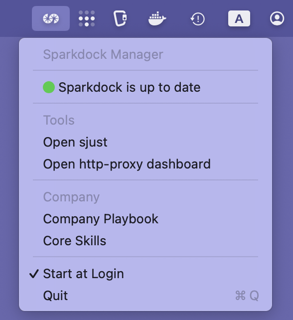

# Sparkdock

[](https://github.com/sparkfabrik/sparkdock/actions/workflows/test-ansible-playbook.yml)

Sparkdock is an automated macOS development environment provisioner built with Ansible. It provides a consistent, reproducible setup for development workstations with containerized workflows and modern tooling.

## Features

### macOS System Defaults

**Developer-Optimized Defaults:**

- **UI/UX Improvements**: Expanded save/print panels, disk-first saving, disabled smart quotes/dashes
- **Finder Enhancements**: Show hidden files and extensions, status/path bars, prevent .DS_Store on networks  
- **Dock Optimizations**: Auto-hide with fast animations, no recent apps, better window behavior
- **Keyboard/Input**: Faster key repeat rates, trackpad right-click, disabled press-and-hold
- **Safari Developer**: Web inspector, developer menu, full URLs, secure defaults
- **Terminal/Development**: UTF-8 encoding, secure input, plain text TextEdit
- **Accessibility**: Reduce motion for better focus and performance
- **System Tools**: Enhanced Activity Monitor, optimized screenshots, Time Machine settings

### Applications & Tools

**GUI Applications:**

- Docker Desktop, Google Chrome, Visual Studio Code
- iTerm2, Ghostty terminal, Slack, Zoom
- Maccy clipboard manager, MonitorControl

**Development Tools:**

- **Languages**: Node.js 20, PHP 8.2, Go, Python 3
- **Version Control**: Git with credential manager, GitHub CLI, GitLab CLI
- **Cloud/Container**: AWS CLI, Kubernetes CLI (kubectl), k9s, Docker credential helper
- **Container Development**: Kind, Kubectx, Skaffold, Stern

**System Utilities:**

- **Shell Enhancement**: Atuin (shell history), fzf (fuzzy finder), thefuck (command correction)
- **Terminal Tools**: tmux, tmate, watch, jq, jless
- **System Info**: fastfetch, mactop
- **Fonts**: Nerd Fonts (Droid Sans Mono, Inconsolata, Fira Code)

### HTTP Proxy System

Integrated [SparkFabrik HTTP Proxy](https://github.com/sparkfabrik/http-proxy) providing:

- Automatic DNS resolution for `.loc` domains
- Local SSL certificates via mkcert
- Containerized reverse proxy with Traefik
- Monitoring dashboards (Grafana + Prometheus)

### Task Automation

**SparkJust (sjust)** - Custom task runner with commands for:

- Docker management (start/stop containers, cleanup)
- HTTP proxy control
- System updates and maintenance
- Package management

## Installation

### Quick Install

```bash
bash <(curl -fsSL https://raw.githubusercontent.com/sparkfabrik/sparkdock/master/bin/install.macos)
```

### System Requirements

- macOS Big Sur (11.x), Monterey (12.x), Ventura (13.x), Sonoma (14.x), or Sequoia (15.x)
- Administrator privileges
- Internet connection

### What Gets Installed

The installation process:

1. **System Prerequisites**: Xcode Command Line Tools, Homebrew
2. **Base Tools**: Git, curl, Python 3, Ansible
3. **Sparkdock Repository**: Cloned to `/opt/sparkdock`
4. **Applications & Tools**: All packages from the configuration
5. **macOS System Defaults**: Developer-optimized system settings
6. **HTTP Proxy System**: Configured and ready to use
7. **Task Runner**: sjust command available system-wide
8. **Update Service**: Automatic update checking via launchd

## Usage

### Main Command

Run the provisioner to configure your system:

```bash
sparkdock
```

### Selective Deployment

Run specific parts of the configuration using Ansible tags:

**macOS System Defaults:**

The macOS defaults configuration is implemented as a YAML-driven sjust task. Both Ansible and direct usage execute the same implementation:

```bash
# Direct usage (recommended for individual use)
sjust macos-defaults              # Apply all macOS developer defaults
sjust macos-defaults-check        # Preview current defaults status
sjust macos-defaults-reset        # Reset selected defaults (use with caution)
sjust macos-defaults-init-overrides  # Create user overrides configuration

# Via Ansible (calls sjust internally)
ansible-playbook ansible/macos.yml --tags macos-defaults --ask-become-pass
```

**User Customization:**

You can override any defaults by creating user-specific configuration:

```bash
# Initialize user overrides directory and example file
sjust macos-defaults-init-overrides

# Edit your custom settings
nano ~/.local/spark/macos-defaults/overrides.yml
```

The system automatically merges your overrides with the default configuration. Configuration is stored in:
- **Default settings**: `config/macos/defaults.yml` (40+ developer-optimized defaults)
- **User overrides**: `~/.local/spark/macos-defaults/overrides.yml` (your customizations)

**Skip macOS Defaults:**
```bash
ansible-playbook ansible/macos.yml --skip-tags macos-defaults --ask-become-pass
```

**Other available tags:**
```bash
ansible-playbook ansible/macos.yml --tags docker --ask-become-pass        # Docker setup only
ansible-playbook ansible/macos.yml --tags http-proxy --ask-become-pass    # HTTP proxy only
ansible-playbook ansible/macos.yml --tags keyboard --ask-become-pass      # Keyboard config only
ansible-playbook ansible/macos.yml --tags sjust --ask-become-pass         # Task runner only
```

### Manual Migration for Existing Users

If you have an existing Sparkdock installation and want to update to the new HTTP proxy system without running the full provisioner:

```bash
cd /opt/sparkdock
git switch master
git fetch && git reset --hard origin/master
make install-sjust
sjust http-proxy-install-update
```

This workflow:

1. Updates your Sparkdock repository to the latest version
2. Installs the `sjust` task runner
3. Runs a targeted Ansible update to install the new HTTP proxy system

### SparkJust Task Runner

View and run available development tasks:

```bash
sjust                    # Show available commands
sjust --list             # List all tasks
sjust docker-ps          # Show running containers
sjust system-upgrade     # Update system packages
sjust system-gcloud-reconfigure  # Configure Google Cloud SDK and install gke-gcloud-auth-plugin
```

### Google Cloud SDK Configuration

Sparkdock automatically installs and configures Google Cloud SDK during provisioning, including the `gke-gcloud-auth-plugin` component required for GKE authentication.

To manually reconfigure Google Cloud SDK:

```bash
sjust system-gcloud-reconfigure
```

This command will:
- Install Google Cloud SDK via Homebrew (if not present)
- Install the `gke-gcloud-auth-plugin` component
- Configure shell completion in your `.zshrc`
- Verify the installation

After configuration, you can verify the plugin is working:

```bash
gke-gcloud-auth-plugin --version
```

### HTTP Proxy

Manage the local development proxy:

```bash
spark-http-proxy start   # Start proxy services
spark-http-proxy stop    # Stop proxy services
spark-http-proxy status  # Check service status
```

### Menu Bar App

Sparkdock includes a native macOS menu bar application that provides quick access to system status and common tasks:



**Features:**
- Real-time system status with colored indicators
- Quick access to development tools and dashboards
- Battery-efficient event-driven updates
- Automatically starts at login via LaunchAgent

**Control the menu bar app:**

```bash
sjust menubar            # Launch the menu bar app manually
```

The app is automatically installed as a LaunchAgent (`com.sparkfabrik.sparkdock.menubar.plist`) and starts at login. It shows update availability and provides one-click access to system updates and development tools.

## Configuration

### Directory Structure

```text
/opt/sparkdock/
├── ansible/             # Ansible playbooks and inventory
├── bin/                 # Main executables and utilities
├── sjust/               # SparkJust task runner
├── config/              # Configuration files and packages
└── http-proxy/          # HTTP proxy system (cloned)
```

### Customization

- **Custom Tasks**: Add to `~/.config/sjust/100-custom.just`
- **Package Lists**: Modify `/opt/sparkdock/config/packages/all-packages.yml`
- **System Settings**: Edit Ansible playbooks in `/opt/sparkdock/ansible/`

## Troubleshooting

For detailed troubleshooting information, see our [troubleshooting guide](TROUBLESHOOTING.md) or visit the [company playbook](http://playbook.sparkfabrik.com/guides/local-development-environment-configuration).

### Common Issues

- **Permission Errors**: Ensure administrator privileges
- **Network Issues**: Check internet connectivity
- **Update Failures**: System automatically rolls back failed updates
- **Lock File Issues**: Remove `/tmp/sparkdock.lock` if stuck

## Development

### Contributing

Contributions welcome! Areas of interest:

- Support for additional operating systems
- New development tools and configurations
- Bug fixes and improvements

### Project Standards

- **Shell Scripts**: Use `set -euo pipefail` and pass shellcheck
- **Ansible**: Idempotent tasks with proper error handling
- **Just Tasks**: Well-documented and focused

## License

Licensed under the GNU General Public License v3.0 - see [LICENSE](LICENSE) for details.

## Maintainers

Maintained by [SparkFabrik](https://www.sparkfabrik.com)'s development team.

Send PRs, open issues, and embrace containerized development!
