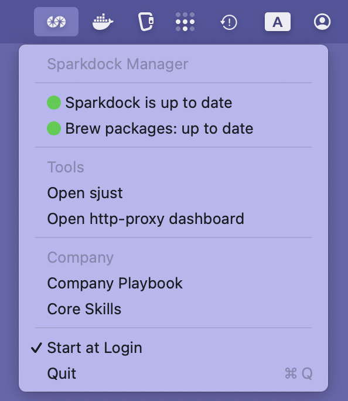

# Sparkdock

[](https://github.com/sparkfabrik/sparkdock/actions/workflows/test-ansible-playbook.yml)
[](https://deepwiki.com/sparkfabrik/sparkdock)

Sparkdock is an automated macOS development environment provisioner built with Ansible. It provides a consistent, reproducible setup for development workstations with containerized workflows and modern tooling.

## Features

### Applications & Tools

**GUI Applications:**

- Docker Desktop, Google Chrome, Visual Studio Code
- iTerm2, Ghostty terminal, Slack, Zoom
- Maccy clipboard manager, MonitorControl

**Development Tools:**

- **Languages**: Node.js 20, PHP 8.2, Go, Python 3
- **Version Control**: Git with credential manager, GitHub CLI, GitLab CLI
- **Cloud/Container**: AWS CLI, Kubernetes CLI (kubectl), k9s, Docker credential helper
- **Container Development**: Kind, Kubectx, Skaffold, Stern

**System Utilities:**

- **Modern Shell Tools**: eza (ls), fd (find), ripgrep (grep), bat (cat), zoxide (cd)
- **Shell Enhancement**: Atuin (shell history), fzf (fuzzy finder), thefuck (command correction)
- **Terminal Tools**: tmux, tmate, watch, jq, jless
- **System Info**: fastfetch, mactop
- **Fonts**: Nerd Fonts (Droid Sans Mono, Inconsolata, Fira Code)

### HTTP Proxy System

Integrated [SparkFabrik HTTP Proxy](https://github.com/sparkfabrik/http-proxy) providing:

- Automatic DNS resolution for `.loc` domains
- Local SSL certificates via mkcert
- Containerized reverse proxy with Traefik
- Monitoring dashboards (Grafana + Prometheus)

### Task Automation

**SparkJust (sjust)** - Custom task runner with commands for:

- Docker management (start/stop containers, cleanup)
- HTTP proxy control
- System updates and maintenance
- Package management

## Installation

### Quick Install

```bash
bash <(curl -fsSL https://raw.githubusercontent.com/sparkfabrik/sparkdock/master/bin/install.macos)
```

### System Requirements

**Operating System:**
- macOS Sequoia (15.x) or macOS Tahoe (26.x)
- Apple Silicon only

**Hardware Requirements:**
- At least 8GB RAM recommended (16GB for heavy development workloads)
- Minimum 10GB free disk space (20GB+ recommended for full development environment)
- Stable internet connection for package downloads

**User Requirements:**
- Administrator privileges (required for system-level configurations)
- Command line familiarity (basic terminal usage)

**Network Requirements:**
- Access to GitHub, Homebrew, and Docker Hub repositories

### What Gets Installed

The installation process:

1. **System Prerequisites**: Xcode Command Line Tools, Homebrew
2. **Base Tools**: Git, curl, Python 3, Ansible
3. **Sparkdock Repository**: Cloned to `/opt/sparkdock`
4. **Applications & Tools**: All packages from the configuration
5. **HTTP Proxy System**: Configured and ready to use
6. **Task Runner**: sjust command available system-wide
7. **Update Service**: Automatic update checking via launchd

## Usage

### Main Command

Run the provisioner to configure your system:

```bash
sparkdock
```

### Manual Migration for Existing Users

If you have an existing Sparkdock installation and want to update to the new HTTP proxy system without running the full provisioner:

```bash
cd /opt/sparkdock
git switch master
git fetch && git reset --hard origin/master
make install-sjust
sjust http-proxy-install-update
```

This workflow:

1. Updates your Sparkdock repository to the latest version
2. Installs the `sjust` task runner
3. Runs a targeted Ansible update to install the new HTTP proxy system

### SparkJust Task Runner

View and run available development tasks:

```bash
sjust                    # Show available commands
sjust --list             # List all tasks
sjust docker-ps          # Show running containers
sjust system-upgrade     # Update system packages
sjust system-gcloud-reconfigure  # Configure Google Cloud SDK and install gke-gcloud-auth-plugin
```

### Google Cloud SDK Configuration

Sparkdock automatically installs and configures Google Cloud SDK during provisioning, including the `gke-gcloud-auth-plugin` component required for GKE authentication.

To manually reconfigure Google Cloud SDK:

```bash
sjust system-gcloud-reconfigure
```

This command will:
- Install Google Cloud SDK via Homebrew (if not present)
- Install the `gke-gcloud-auth-plugin` component
- Configure shell completion in your `.zshrc`
- Verify the installation

After configuration, you can verify the plugin is working:

```bash
gke-gcloud-auth-plugin --version
```

### Shell Enhancements

Sparkdock provides a modern shell experience with oh-my-zsh, starship prompt, and enhanced command-line tools.

**Setup:**

```bash
sjust shell-setup-omz    # Install oh-my-zsh and zsh plugins
sjust shell-enable       # Add Sparkdock config to your ~/.zshrc
```

**Modern Tools Included:**
- `eza` - Modern `ls` with colors and icons (`ls`, `lt`, `lta` aliases)
- `fd` - Modern `find` for faster file search
- `ripgrep` (rg) - Modern `grep` for faster text search
- `bat` - Modern `cat` with syntax highlighting
- `fzf` - Fuzzy finder (`ff` function, `Ctrl+R` for history)
- `zoxide` - Smart `cd` (`z <dir>` to jump to directories)
- **starship** - Fast, customizable prompt
- **oh-my-zsh** - Zsh configuration framework with plugins:
  - zsh-autosuggestions - Command suggestions as you type
  - zsh-syntax-highlighting - Syntax highlighting
  - zsh-completions - Additional completions
  - ssh-agent - SSH key management

**Commands:**

```bash
sjust shell-info              # View status and features
sjust shell-aliases-help      # List all available aliases
sjust shell-disable           # Remove from ~/.zshrc
```

**Customization:**

Create `~/.config/spark/shell.zsh` for personal customizations (automatically sourced).

### HTTP Proxy

Manage the local development proxy:

```bash
spark-http-proxy start   # Start proxy services
spark-http-proxy stop    # Stop proxy services
spark-http-proxy status  # Check service status
```

### Menu Bar App

Sparkdock includes a native macOS menu bar application that provides quick access to system status and common tasks:



**Features:**
- Real-time system status with colored indicators
- Quick access to development tools and dashboards
- Battery-efficient event-driven updates
- Automatically starts at login via LaunchAgent

**Control the menu bar app:**

```bash
sjust menubar            # Launch the menu bar app manually
```

The app is automatically installed as a LaunchAgent (`com.sparkfabrik.sparkdock.menubar.plist`) and starts at login. It shows update availability and provides one-click access to system updates and development tools.

## Configuration

### Directory Structure

```text
/opt/sparkdock/
├── ansible/             # Ansible playbooks and inventory
├── bin/                 # Main executables and utilities
├── sjust/               # SparkJust task runner
├── config/              # Configuration files and packages
└── http-proxy/          # HTTP proxy system (cloned)
```

### Customization

- **Custom Tasks**: Add to `~/.config/sjust/100-custom.just`
- **Package Lists**: Modify `/opt/sparkdock/config/packages/all-packages.yml`
- **System Settings**: Edit Ansible playbooks in `/opt/sparkdock/ansible/`

## Troubleshooting

For detailed troubleshooting information, see our [troubleshooting guide](TROUBLESHOOTING.md) or visit the [company playbook](http://playbook.sparkfabrik.com/guides/local-development-environment-configuration).

### Common Issues

- **Permission Errors**: Ensure administrator privileges
- **Docker Desktop Network Problems**: Use `sjust docker-desktop-*` commands for UDP and host networking issues
- **Update Failures**: System automatically rolls back failed updates
- **Lock File Issues**: Remove `/tmp/sparkdock.lock` if installation appears stuck
- **DNS Resolution**: Use `sjust system-clear-dns-cache` to clear DNS cache
- **HTTP Proxy Issues**: Use `sjust http-proxy-install-update` to restart proxy services

## Development

### Contributing

Contributions welcome! Areas of interest:

- Support for additional operating systems
- New development tools and configurations
- Bug fixes and improvements

### Project Standards

- **Shell Scripts**: Use `set -euo pipefail` and pass shellcheck
- **Ansible**: Idempotent tasks with proper error handling
- **Just Tasks**: Well-documented and focused

## License

Licensed under the GNU General Public License v3.0 - see [LICENSE](LICENSE) for details.

## Maintainers

Maintained by [SparkFabrik](https://www.sparkfabrik.com)'s development team.

Send PRs, open issues, and embrace containerized development!
