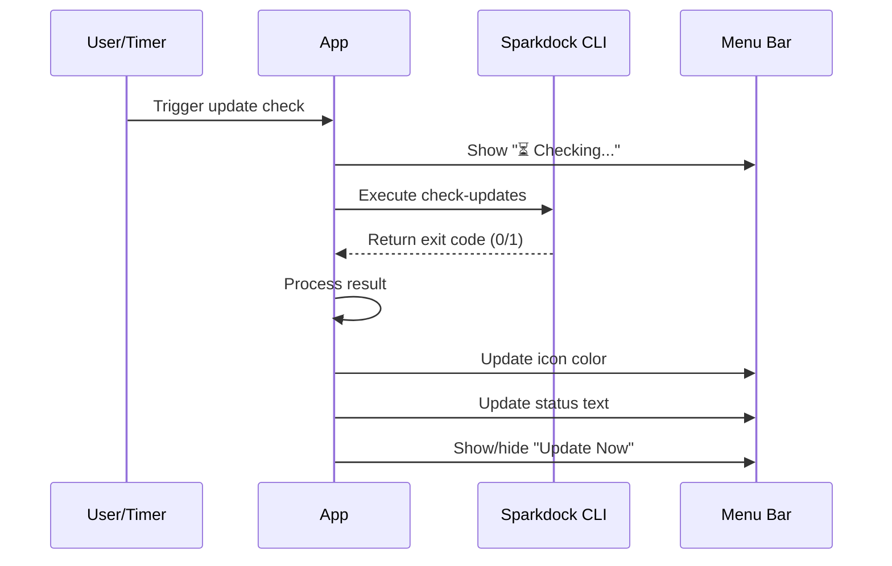
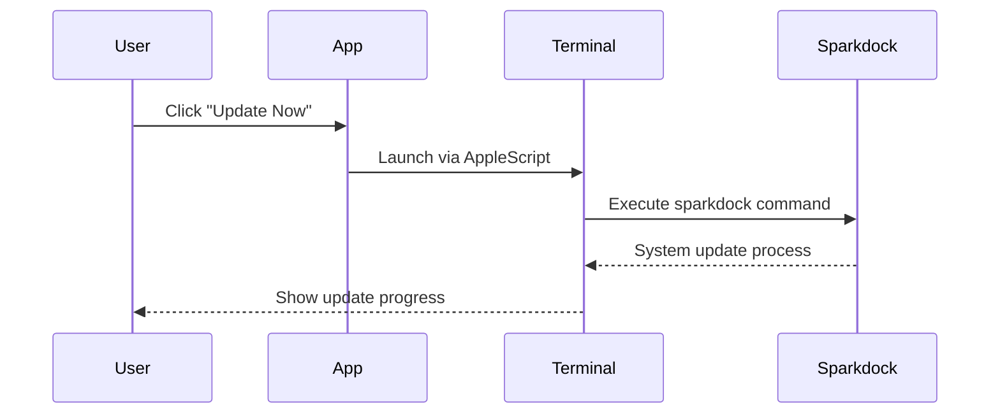

# System Architecture - Sparkdock Manager

## Overview

The Sparkdock Manager is a native macOS menu bar application that serves as a visual status indicator and control interface for the Sparkdock development environment provisioning system.

## High-Level Architecture

```mermaid
graph TB
    A[Menu Bar Icon] --> B[SparkdockMenubarApp]
    B --> C[Menu Interface]
    B --> D[Update Service]
    B --> E[Icon Manager]
    
    D --> F[Git Repository Check]
    F --> G[/opt/sparkdock/bin/sparkdock.macos]
    
    E --> H[Logo Loading]
    E --> I[Icon State Management]
    
    C --> J[Terminal Integration]
    C --> K[Login Item Management]
    
    J --> L[AppleScript Execution]
    K --> M[ServiceManagement Framework]
    
    style A fill:#e1f5fe
    style B fill:#f3e5f5
    style G fill:#fff3e0
```

## Core Components

### 1. Main Application (`SparkdockMenubarApp`)

**Purpose**: Central coordinator and NSApplication delegate  
**Responsibilities**:
- Menu bar item lifecycle management
- Timer-based update scheduling (4-hour intervals)
- UI state coordination
- System integration

### 2. Configuration Management (`AppConstants`)

**Purpose**: Centralized configuration and constants  
**Contents**:
- Update check interval (4 hours)
- Sparkdock executable path (`/opt/sparkdock/bin/sparkdock.macos`)
- Icon dimensions and resource names
- UI sizing constants

### 3. Update Detection System

**Purpose**: Monitor Sparkdock repository for changes  
**Mechanism**:
- Executes `sparkdock.macos check-updates` command
- Interprets exit codes (0 = updates available, 1 = up to date)
- Background execution on GCD utility queue
- Main thread UI updates

### 4. Visual Status System

**Purpose**: Provide immediate visual feedback to users  
**States**:
- **Normal**: White/template icon (system up to date)
- **Updates Available**: Orange-tinted icon (updates pending)
- **Checking**: Temporary status during update checks

### 5. Menu Interface

**Structure**:
```
Sparkdock                    [Title, non-clickable]
────────────────────────────
✅ Sparkdock is up to date   [Status, clickable to refresh]
────────────────────────────
Update Now                   [Visible only when updates available]
────────────────────────────
Open sjust                   [Command launcher]
────────────────────────────
Start at Login ✓            [Toggle, modern or LaunchAgent]
────────────────────────────
Quit                         [Application termination]
```

## System Integrations

### 1. Sparkdock Core System

**Integration Point**: `/opt/sparkdock/bin/sparkdock.macos`  
**Commands Used**:
- `check-updates`: Returns 0 if updates available, 1 if up to date
- `sparkdock`: Main system update command

### 2. macOS Terminal Integration

**Method**: AppleScript execution  
**Purpose**: Launch commands in user's default Terminal  
**Commands**:
- `sparkdock`: System update execution
- `sjust`: Development environment launcher

### 3. macOS Login Item Management

**Modern (macOS 13+)**: ServiceManagement framework  
**Legacy (macOS 12-)**: LaunchAgent plist file  
**Location**: `~/Library/LaunchAgents/com.sparkfabrik.sparkdock.menubar.plist`

### 4. Icon Resource Management

**Primary**: Custom SparkFabrik logo (`sparkfabrik-logo.png`)  
**Fallback Strategy**:
1. Bundle.main resource loading
2. Bundle.module resource loading  
3. System symbol (`gearshape.fill` on macOS 11+)
4. Generated circle shape (ultimate fallback)

## Data Flow

### Update Check Flow



### User Action Flow



## State Management

### Application States

1. **Initializing**: App startup, first update check
2. **Idle**: Normal operation, periodic checks
3. **Checking**: Active update detection in progress
4. **Updates Available**: Pending updates detected
5. **Updating**: User-triggered update in progress

### Icon States

- **Template (White)**: `icon.isTemplate = true`, system applies color
- **Orange Tinted**: `icon.isTemplate = false`, custom orange overlay
- **Default Fallback**: System symbol or generated shape

## Error Handling

### Graceful Degradation

1. **Logo Loading Failure**: Falls back to system symbols or generated icons
2. **Sparkdock Unavailable**: Update checks return false, no crashes
3. **Terminal Integration Failure**: Silent failure with error logging
4. **Login Item Registration Failure**: Shows notification, continues operation

### Recovery Mechanisms

- **Update Check Failure**: Retry on next timer cycle
- **Process Execution Errors**: Logged but don't crash app
- **Menu Creation Issues**: Falls back to minimal menu structure

## Performance Characteristics

### Resource Usage

- **Memory**: ~5-10MB typical usage
- **CPU**: Minimal except during 4-hour update checks
- **Network**: None (Git operations handled by Sparkdock CLI)
- **Disk**: Negligible (small executable + resources)

### Update Check Performance

- **Frequency**: Every 4 hours
- **Duration**: 1-3 seconds typical
- **Background Processing**: Non-blocking UI
- **Failure Recovery**: Automatic retry on next cycle

## Security Considerations

### Execution Safety

- **Command Execution**: Only predefined commands via secure paths
- **Input Validation**: No user input processing
- **Privilege Escalation**: None required for normal operation
- **Data Access**: Read-only access to Git repository status

### System Integration

- **LaunchAgent**: Standard macOS auto-start mechanism
- **ServiceManagement**: Modern, sandboxed login item management  
- **AppleScript**: Standard Terminal integration method
- **File Access**: Limited to known paths and resources